<div align="center">
  
  <h1 align="center">
    Flectar Mail
  </h1>
  <div align="center">
    <h3>Email, made fast again</h3>
    <p>Built from the ground up for speed. Flectar Mail delivers native performance, instant startup, and as little as 20 MB of RAM.</p>
  </div>
  <p>
    <a href="https://flectar.com">Website</a> ·
    <a href="https://github.com/flectar/mail/issues">Report an issue</a> ·
    <a href="CONTRIBUTING.md">Contribute</a>
  </p>
</div>

<picture>
  <source media="(prefers-color-scheme: dark)" srcset="resources/screenshots/desktop-dark.png">
  <source media="(prefers-color-scheme: light)" srcset="resources/screenshots/desktop-light.png">
  
</picture>

Flectar Mail is a lightweight, native home for your email, calendars, and
contacts. It is engineered to open instantly, stay responsive, and use a
fraction of the memory of a typical web-based mail client.

## Why Flectar Mail?

- **Fast from the first click.** A native interface and local-first data path
  get you to your inbox without waiting on a browser runtime.
- **As little as 20 MB of RAM.** Flectar Mail is deliberately designed to keep
  memory use low, even with a full-featured inbox at your fingertips.
- **Everything in one place.** Move between mail, calendars, and contacts
  without stitching together separate apps.
- **Offline by design.** Your mailbox and calendar are stored locally, so your
  synced data remains useful without a connection.
- **Works with your accounts.** Connect Gmail, Outlook and Microsoft 365, or
  standards-based IMAP/SMTP, JMAP, and CalDAV services.
- **Privacy-conscious defaults.** Remote images are blocked until you allow
  them, helping prevent tracking pixels from reporting when you read a message.
- **Security by architecture.** Email content is never opened in a WebView.
  Flectar Mail renders HTML and CSS through its own Rust-native pipeline, does
  not execute email scripts, and blocks remote images by default. This avoids
  the embedded-browser attack surface by design.
- **An experimental Rust renderer.** Building an email renderer without a
  browser engine is new territory. Rendering issues are expected, especially
  in complex messages, while compatibility continues to improve.
- **Made for every screen.** Spacious and minimal desktop layouts share the
  same experience as the touch-friendly compact interface.
- **Native and open source.** Built from the ground up with Rust. It is not a
  browser wrapped in a window, and it is released under the AGPLv3.

## Experimental HTML rendering

> [!WARNING]
> HTML email rendering is currently the most experimental part of Flectar Mail.
> Some messages, especially those with complex or unusual markup and CSS, may
> not render correctly yet.

To keep the client fully native and memory usage around 20 MB, Flectar Mail
renders email HTML with [Blitz](https://github.com/DioxusLabs/blitz), a Rust
HTML/CSS renderer from the Dioxus team, instead of embedding a browser or
WebView.

As far as we know, Flectar Mail is one of the first projects using Blitz for
arbitrary, real-world email HTML. Email markup contains plenty of unusual HTML
and CSS, so this pushes the renderer into demanding territory. We currently
carry several patches on top of Blitz and hope to upstream as much of that work
as possible over time.

If you find an email that renders incorrectly, please
[report it](https://github.com/flectar/mail/issues). This approach is still
experimental, but it is also a major reason Flectar Mail can remain so
lightweight compared with WebView-based clients built with frameworks such as
Tauri or Wails.

## Make it yours

Choose the workspace that fits the way you handle email. Keep the detailed
three-pane layout, switch to a streamlined minimal view, choose a light or dark
theme, select a built-in color palette or create a custom one, and show or hide
sender avatars.

The full workspace keeps your folders, message list, and selected email visible
together. The minimal layout reduces visual noise and gives each part of your
inbox more room when you need it.

### Light

| Full workspace | Minimal workspace |
| --- | --- |
|  | 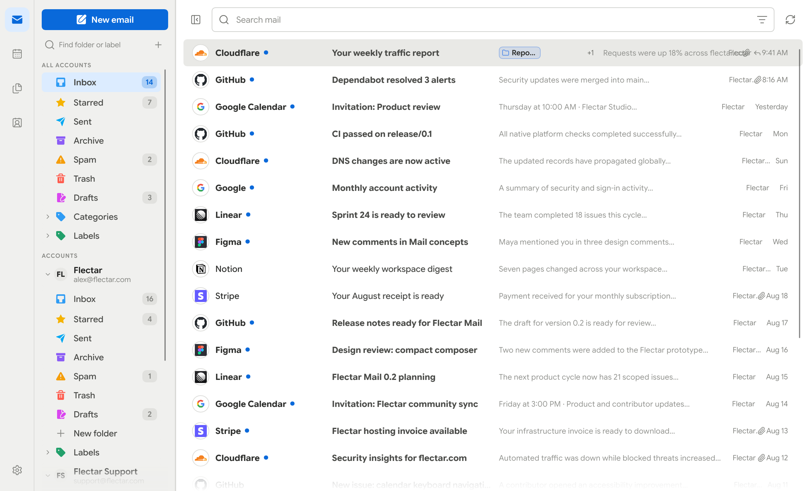 |

### Dark

| Full workspace | Minimal workspace |
| --- | --- |
| 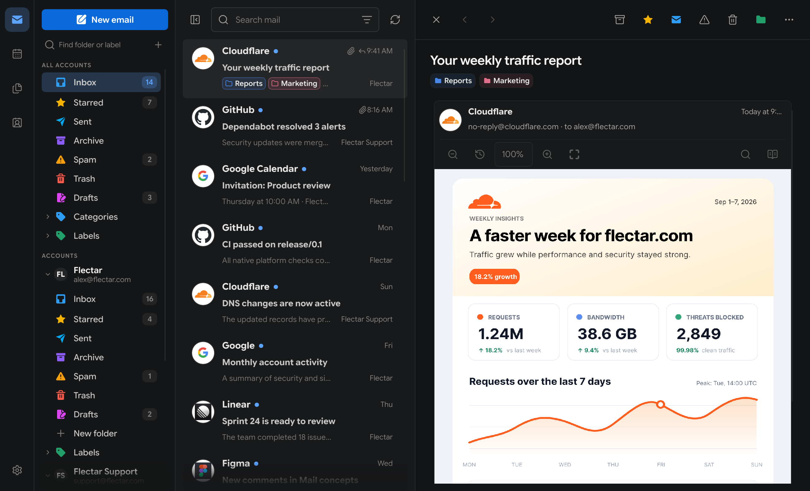 | 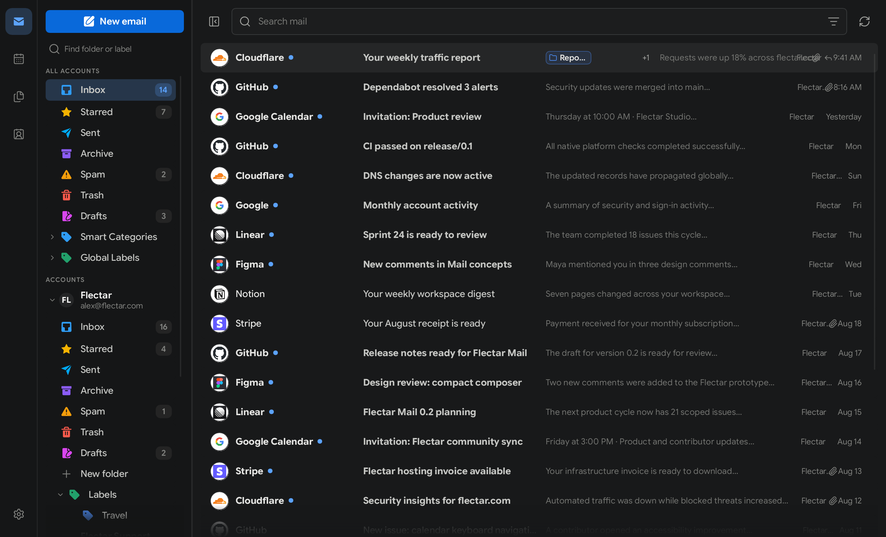 |

### Color palettes

| Teal | Green | Purple | Custom |
| --- | --- | --- | --- |
| 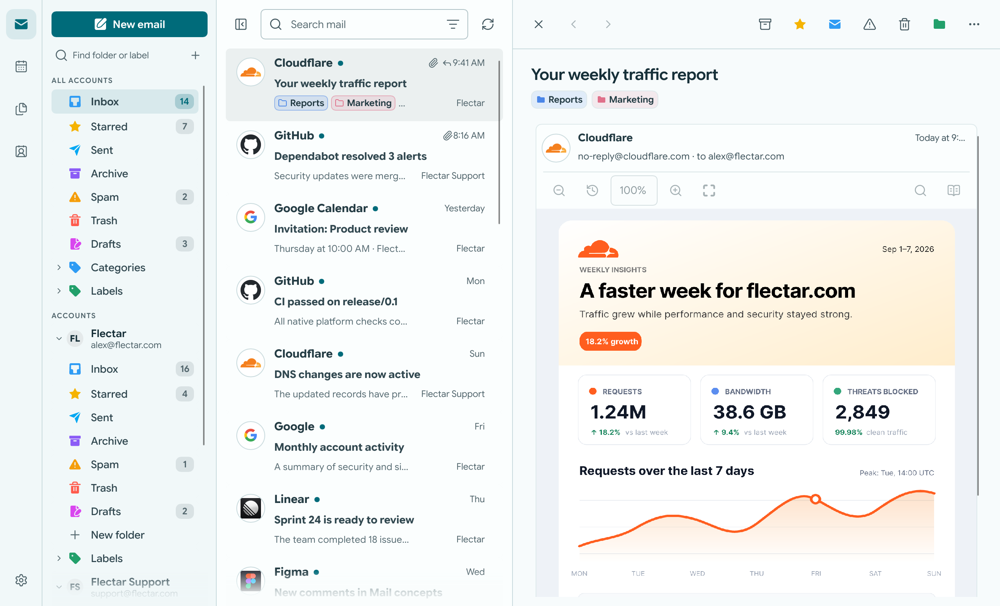 | 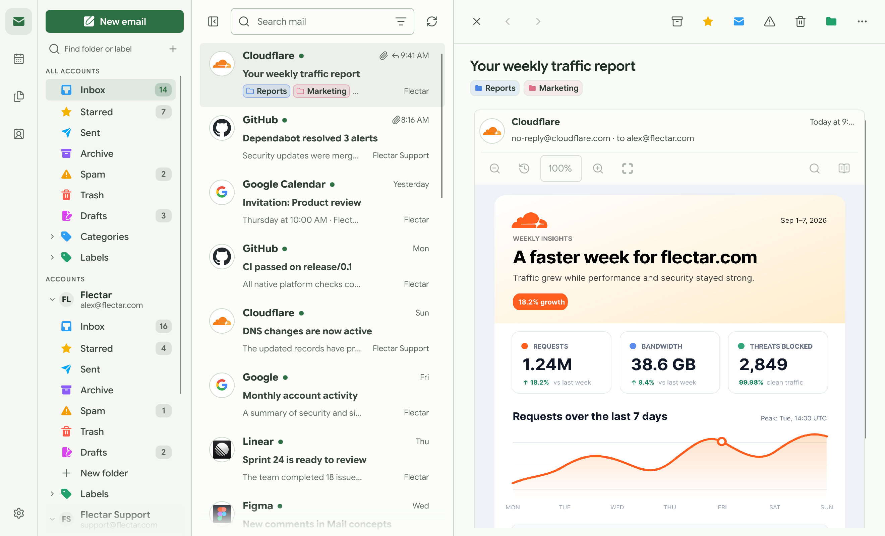 | 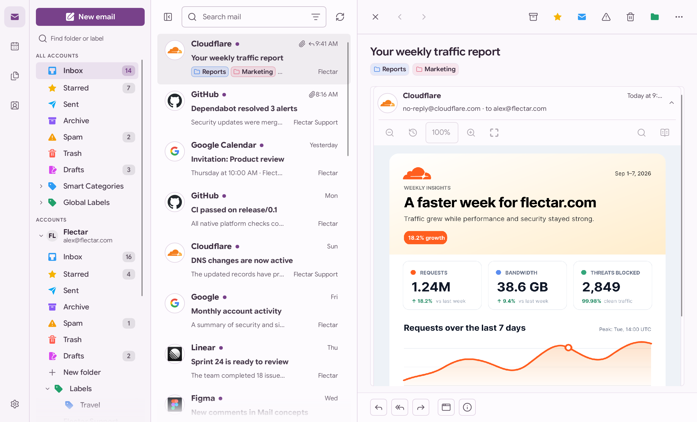 |  |
| 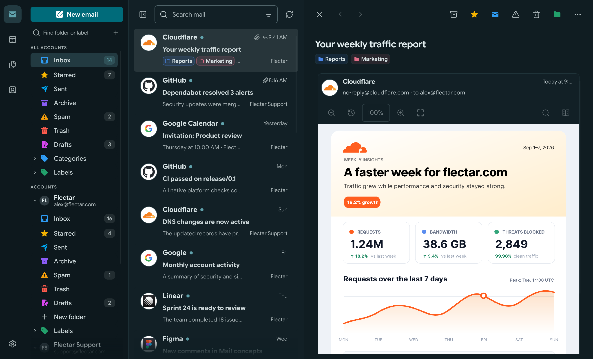 | 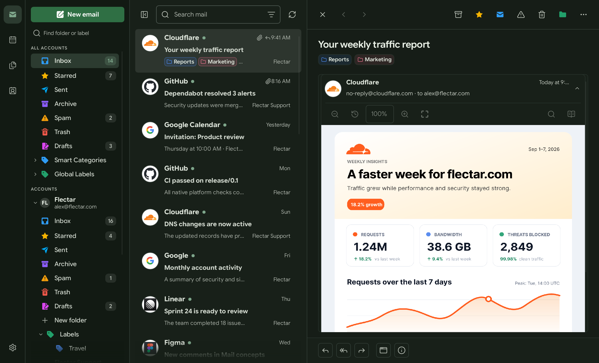 | 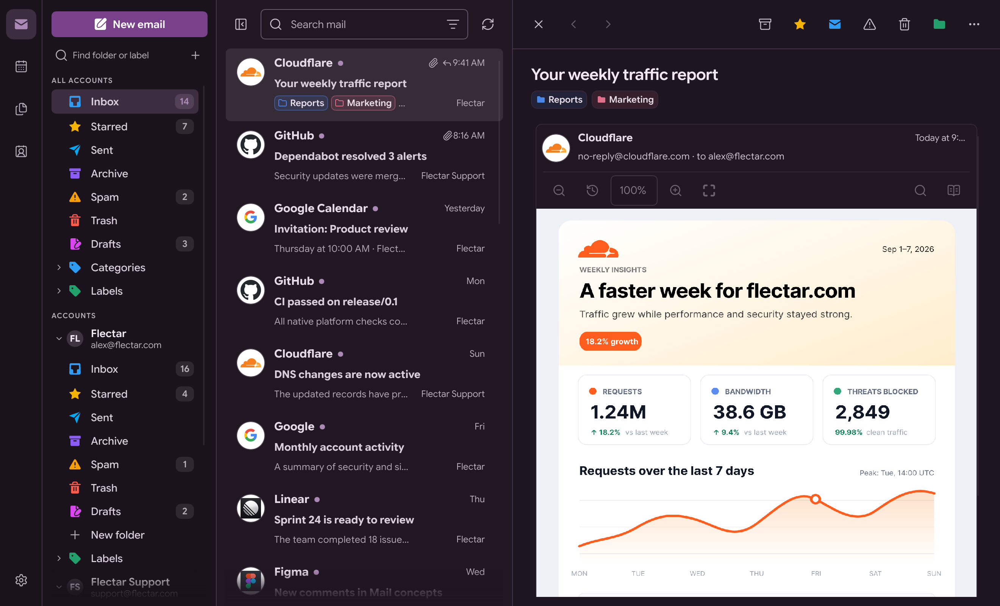 |  |

### Calendar, contacts, and files

| Calendar | Contacts | Files (WebDAV/JMAP) |
| --- | --- | --- |
| 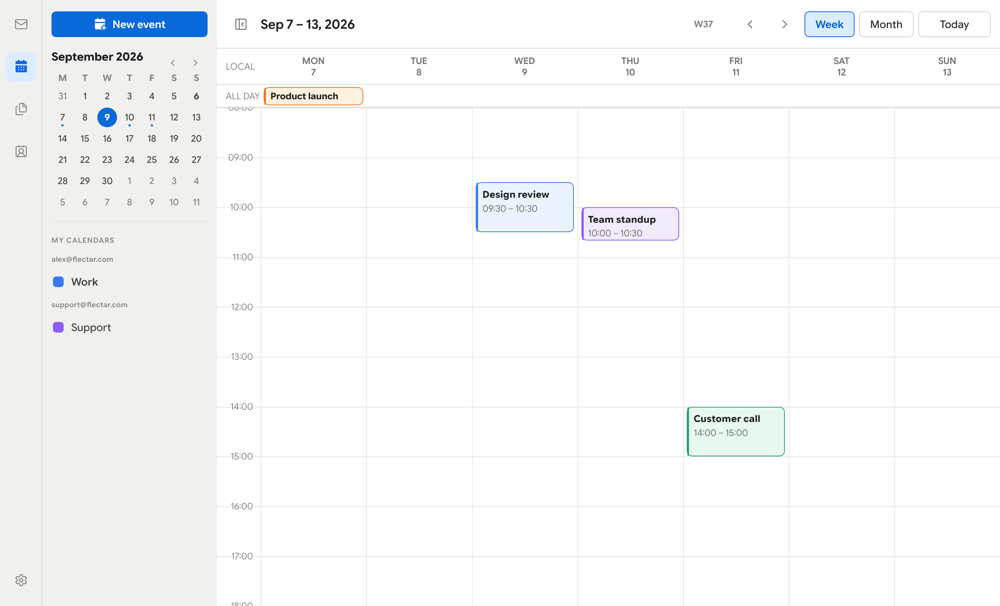 | 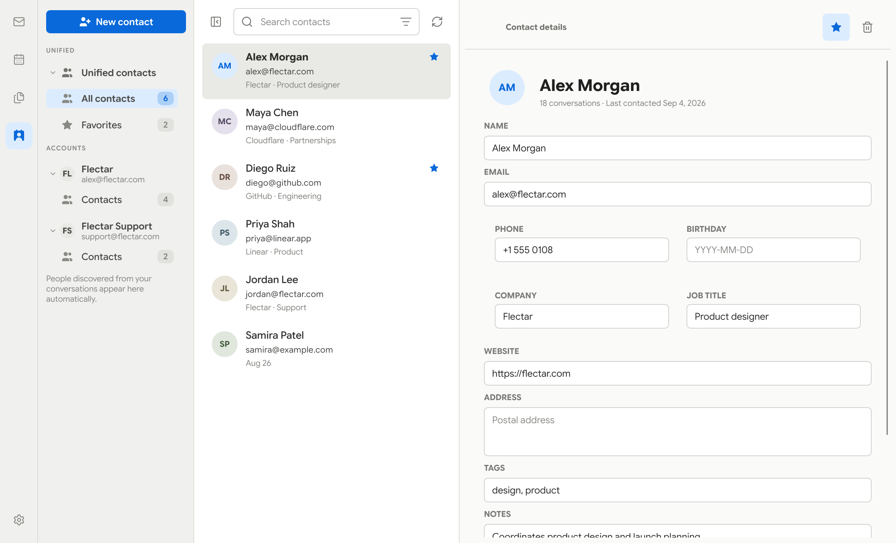 | **Coming soon** |

### Made for smaller screens

The compact interface keeps the important actions within reach while giving
messages, events, and contacts the full screen when they need it.

| Light | Dark |
| --- | --- |
| 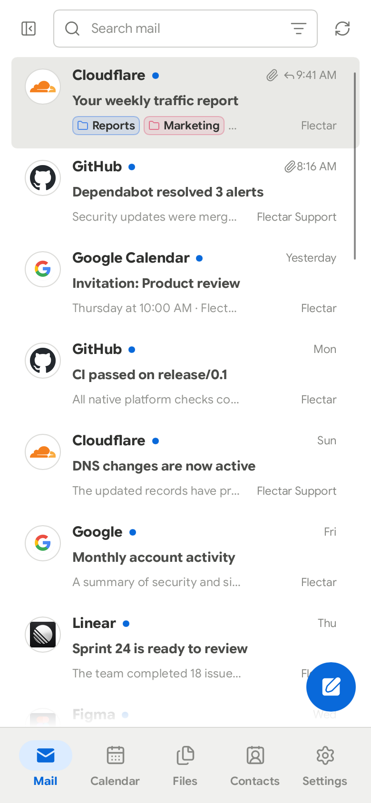 | 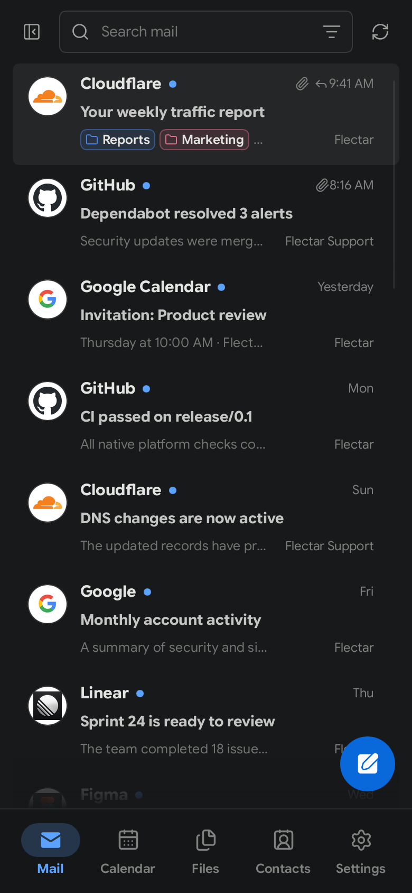 |

## Get Flectar Mail

Flectar Mail is currently in development and is not yet stable.

> [!NOTE]
> We are waiting for Google and Microsoft to complete OAuth app verification
> before the first stable release with Gmail, Outlook, and Microsoft 365 OAuth
> configured by default. Earlier GitHub prereleases are intended for testers
> using their own OAuth registrations or IMAP/JMAP accounts.

Builds without OAuth app keys keep Gmail and Outlook sign-in disabled. Use the
**Sign-in settings** cog on the welcome screen to save your own Google or
Microsoft app registration, or connect an IMAP/JMAP account. Custom keys are
shared with Settings and take precedence over bundled keys; clearing a custom
client ID restores the defaults when available. Each provider enables separately
once its configuration is saved.

When preview builds are published, download them from
[GitHub Releases](https://github.com/flectar/mail/releases) and look for the
**Pre-release** badge:

- **Linux x64:** AppImage or Debian/Ubuntu `.deb` package
- **Windows x64:** Setup `.exe` or portable ZIP
- **macOS Apple silicon (macOS 14+):** DMG or application ZIP
- **Android arm64 (Android 8.0+):** Experimental test APK in prereleases

Windows previews are unsigned; macOS previews are ad-hoc signed and not
notarized, so operating-system security prompts are expected. Install updates
manually.

Android APK updates require the same signing key; builds without a persistent
test key may require uninstalling the previous app, which deletes local app data.

You can also build Flectar Mail from source with the
[Rust toolchain](https://rustup.rs/):

```bash
cargo run --bin flectar-mail
```

## Open source, for everyone

Flectar Mail is one open-source application. There is no separate community
edition. The client is licensed under the
[GNU Affero General Public License v3](LICENSE). Read the
[licensing overview](LICENSING.md) for the practical details, or see
[CONTRIBUTING.md](CONTRIBUTING.md) to help shape the project.

## Acknowledgements

Flectar Mail is made possible by the work of these projects and their
contributors:

- [Slint](https://slint.dev/), the native UI toolkit that powers the Flectar
  Mail interface.
- [Blitz](https://github.com/DioxusLabs/blitz), the Rust HTML/CSS renderer from
  the Dioxus team that powers the email reading experience.

---
