<div align="center">
  
  <h1 align="center">
    Flectar Mail
  </h1>
  <p>
    <a href="README.md">English</a> · <strong>简体中文</strong>
  </p>
  <div align="center">
    <h3>邮件，重归迅捷</h3>
    <p>从底层开始，为速度而构建。Flectar Mail 提供原生性能、瞬时启动，内存占用可低至 100 MB。</p>
  </div>
  <p>
    <a href="https://flectar.com">官网</a> ·
    <a href="https://github.com/flectar/mail/issues">报告问题</a> ·
    <a href="CONTRIBUTING.md">参与贡献</a>
  </p>
  <p>
    <a href="LICENSE"></a>
    <a href="https://github.com/flectar/mail/releases"></a>
    <a href="https://github.com/flectar/mail/releases"></a>
    <a href="https://translate.flectar.com/engage/flectar-mail/"></a>
  </p>
  <p>
    <a href="https://www.rust-lang.org/"></a>
    
  </p>
</div>

<picture>
  <source media="(prefers-color-scheme: dark)" srcset="resources/screenshots/desktop-dark.png">
  <source media="(prefers-color-scheme: light)" srcset="resources/screenshots/desktop-light.png">
  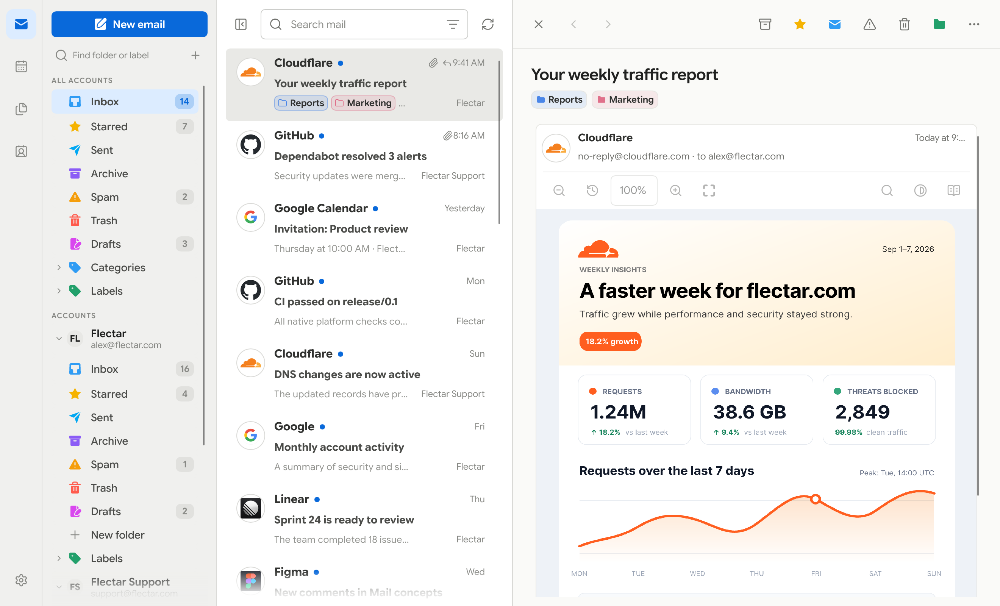
</picture>

Flectar Mail 是一个轻量、原生的客户端，用来承载你的邮件、日历和联系人。它经过专门设计，能够瞬时打开、始终保持流畅，内存占用仅为常见网页版邮件客户端的一小部分。

## ❓ 为什么选择 Flectar Mail？

- **从第一次点击起就快。** 原生界面与本地优先的数据通路，让你无需等待浏览器运行时即可进入收件箱。
- **内存占用可低至 100 MB。** Flectar Mail 刻意把内存占用控制在较低水平，即使全功能收件箱就在手边也是如此。
- **所有内容集中一处。** 在邮件、日历和联系人之间切换，无需拼凑多个相互独立的应用。
- **生来支持离线。** 邮箱和日历都存储在本地，因此已同步的数据在没有网络连接时依然可用。
- **兼容你的各类账户。** 可连接 Gmail、Outlook 和 Microsoft 365，也可连接基于标准的 IMAP/SMTP、JMAP、CalDAV 与 CardDAV 服务。
- **注重隐私的默认设置。** 远程图片在你允许之前会被拦截，有助于防止跟踪像素上报你阅读邮件的时间。
- **以架构保障安全。** 邮件内容从不在 WebView 中打开。Flectar Mail 通过自有的 Rust 原生管线渲染 HTML 与 CSS，不执行邮件中的脚本，并默认拦截远程图片，由此在设计上规避了内嵌浏览器的攻击面。
- **实验性的 Rust 渲染器。** 不借助浏览器引擎来构建邮件渲染器，是一片全新的领域。渲染问题在所难免，复杂邮件尤其如此，兼容性仍在持续改进。
- **适配各种屏幕。** 宽裕的桌面布局和极简桌面布局，与触控友好的紧凑界面提供一致的体验。
- **原生且开源。** 完全以 Rust 从底层构建，不是套在窗口里的浏览器，并按 AGPLv3 发布。

## 📁 文件与附件

浏览 JMAP/WebDAV 存储、搜索邮件附件、将文件保存为离线副本，并预览 PDF、图像和文本。

## ✍🏻 账户签名与 OpenPGP

在「设置 → 账户 → 签名与 OpenPGP」中，你可以创建具名签名、分别为新建邮件和回复设置默认签名，并在邮件编辑器中选择要插入的签名。桌面端的 OpenPGP/MIME 签名与加密使用本机安装的 GnuPG 2.x，私钥口令通过 pinentry 输入。当要求加密而收件人密钥缺失或无效时，会阻止发送；受保护的草稿在发送前仅保存在本地。

目前不支持 S/MIME 与移动端 OpenPGP。

## 🧪 实验性的 HTML 渲染

> [!WARNING]
> HTML 邮件渲染目前是 Flectar Mail 中最具实验性的部分。部分邮件，尤其是标记与 CSS 复杂或特殊的邮件，可能仍无法正确渲染。

为了保持客户端完全原生、把内存占用维持在 100 MB 左右，Flectar Mail 使用 [Blitz](https://github.com/DioxusLabs/blitz)——Dioxus 团队开发的 Rust HTML/CSS 渲染器——来渲染邮件 HTML，而不是内嵌浏览器或 WebView。

桌面版在「设置 → 常规 → 渲染器」下提供 **CPU — 低内存** 与 **GPU — WGPU** 两个选项。初始选择 CPU，且不会初始化 WGPU。GPU 选项在共享的 WGPU 29 设备上使用 Slint 与 Vello；更改设置后需重启应用才会生效。GPU 启动失败时会自动回退到 CPU。

据我们所知，Flectar Mail 是最早把 Blitz 用于真实场景中任意邮件 HTML 的项目之一。邮件标记中含有大量非常规的 HTML 与 CSS，这会把渲染器推向要求极高的领域。目前我们在 Blitz 之上维护了若干补丁，并希望随时间推移尽可能多地把这些工作回流上游。

如果你发现某封邮件渲染有误，请[提交问题](https://github.com/flectar/mail/issues)。这一方案仍处于实验阶段，但它也是 Flectar Mail 相比基于 Tauri、Wails 等框架构建的 WebView 客户端能够如此轻量的重要原因。

## 🎨 随心定制

选择适合你处理邮件方式的工作区：保留信息详尽的三栏布局，或切换到更简洁的极简视图；选择浅色或深色主题；使用内置配色或创建自定义配色；还可以显示或隐藏发件人头像。

完整工作区将文件夹、邮件列表和所选邮件同时显示在一起。极简布局减少视觉干扰，在你需要时为收件箱的每个部分留出更大空间。

### 👥 分组与账户颜色

把相关账户归入具名分组，例如「工作」或「个人」，再为每个分组指定颜色。在「设置 → 账户 → 分组」中，你可以分配账户、覆盖单个账户的颜色，并在每封邮件的左边缘显示最终生效的颜色。在统一收件箱中处理邮件时，这些色标让账户易于区分；下例中「工作」使用紫色，「支持」使用橙色。

<picture>
  <source media="(prefers-color-scheme: dark)" srcset="resources/screenshots/desktop-profiles-dark.png">
  <source media="(prefers-color-scheme: light)" srcset="resources/screenshots/desktop-profiles-light.png">
  
</picture>

### 🧵 会话线程

回复按时间顺序归组显示，当前邮件在阅读窗格中展开。

<picture>
  <source media="(prefers-color-scheme: dark)" srcset="resources/screenshots/desktop-thread-dark.png">
  <source media="(prefers-color-scheme: light)" srcset="resources/screenshots/desktop-thread-light.png">
  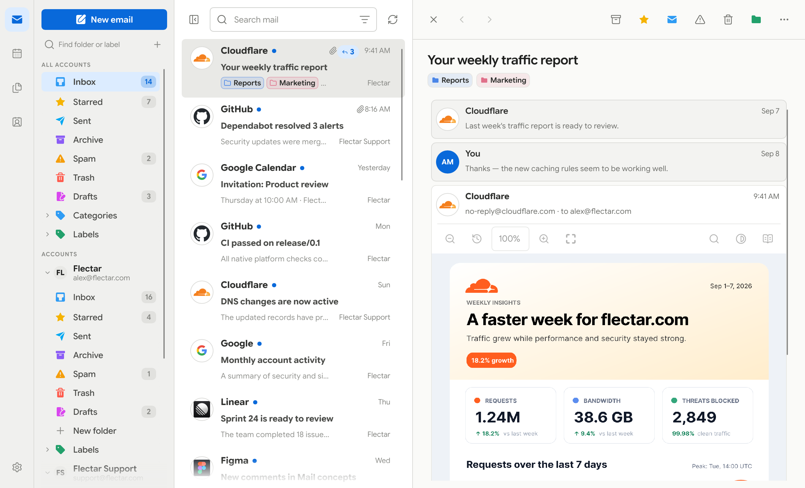
</picture>

### 浅色

| 完整工作区                                                                          | 极简工作区                                                                                  |
|-------------------------------------------------------------------------------------|---------------------------------------------------------------------------------------------|
|  | 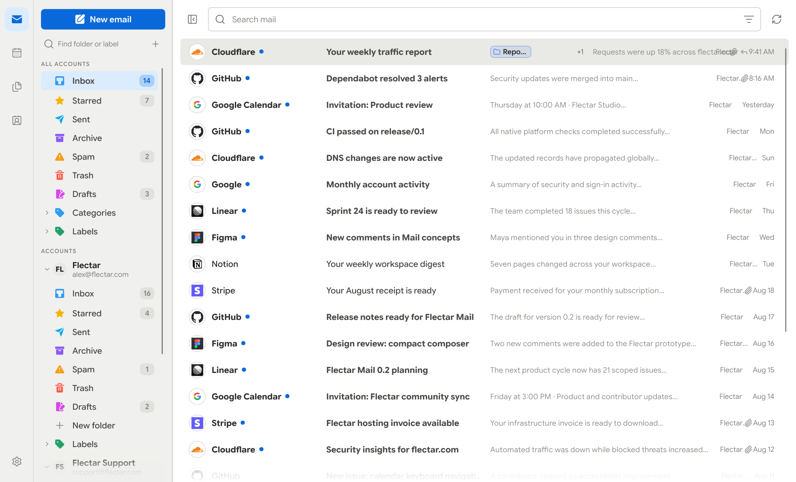 |

### 深色

| 完整工作区                                                                         | 极简工作区                                                                                 |
|------------------------------------------------------------------------------------|--------------------------------------------------------------------------------------------|
| 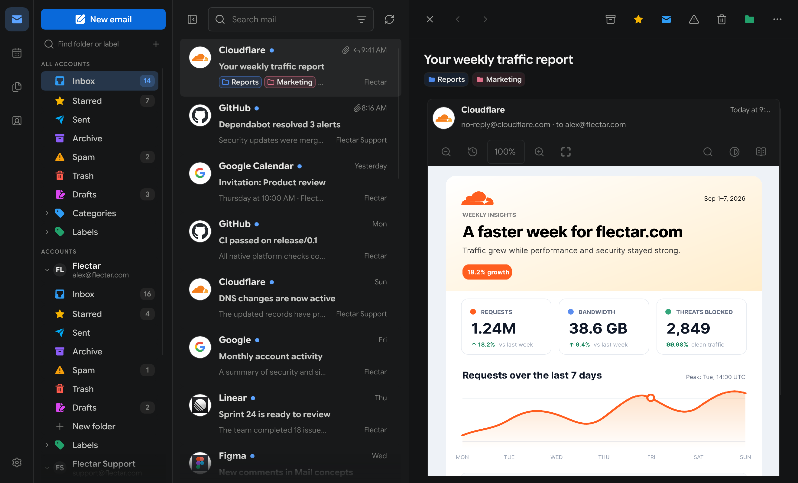 | 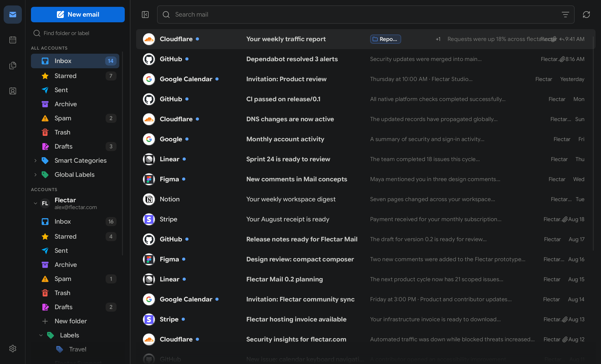 |

### 配色

| 青绿                                                                               | 绿色                                                                                | 紫色                                                                                 | 自定义                                                                          |
|------------------------------------------------------------------------------------|-------------------------------------------------------------------------------------|--------------------------------------------------------------------------------------|---------------------------------------------------------------------------------|
| 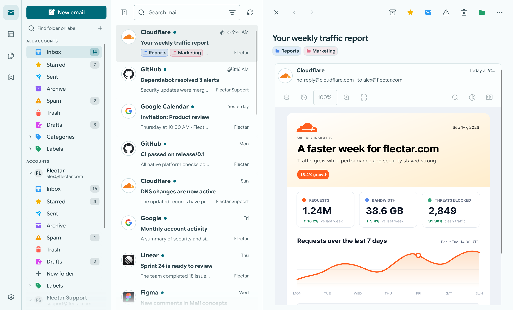 | 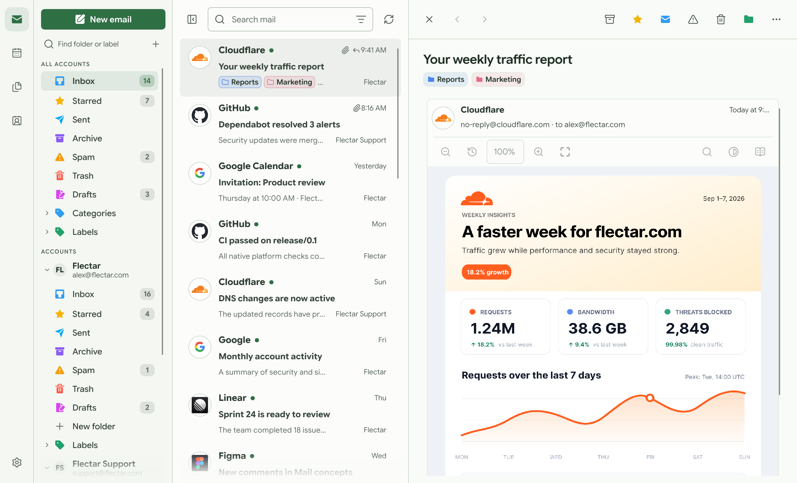 | 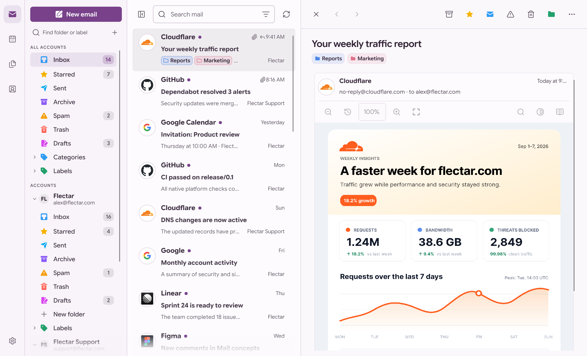 |  |
| 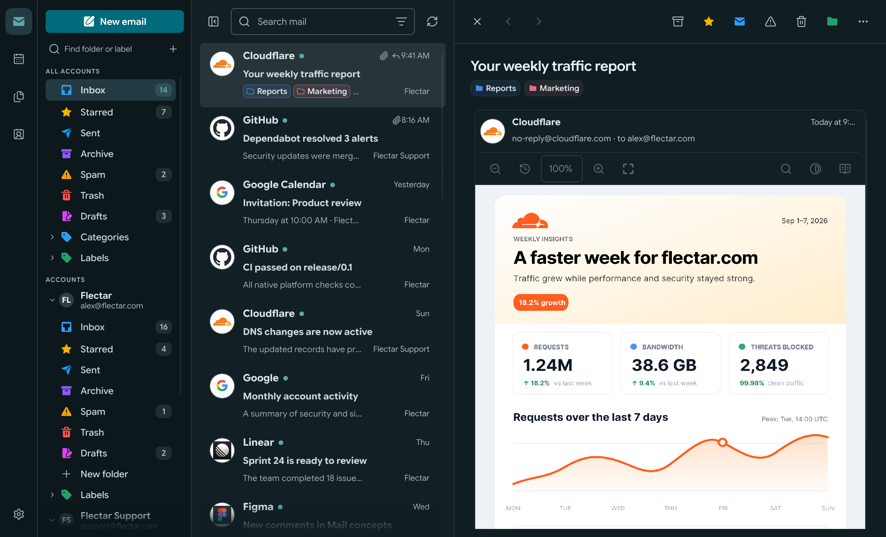  | 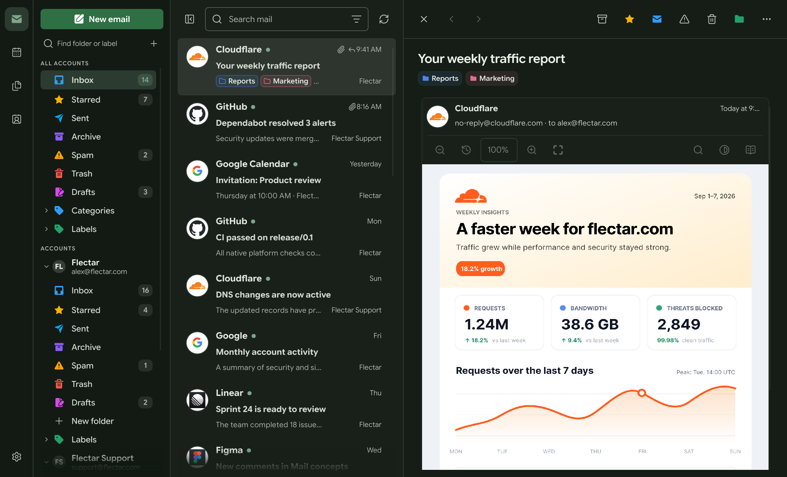  | 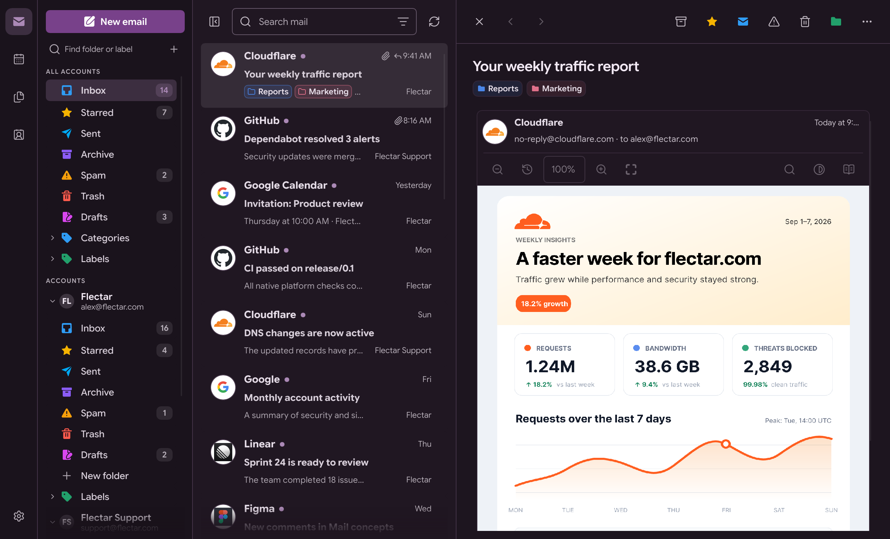  |   |

### 📅 日历、联系人与文件

<table>
  <thead>
    <tr>
      <th width="33.33%">日历</th>
      <th width="33.33%">联系人</th>
      <th width="33.33%">文件（WebDAV/JMAP）</th>
    </tr>
  </thead>
  <tbody>
    <tr>
      <td width="33.33%">
        <picture>
          <source media="(prefers-color-scheme: dark)" srcset="resources/screenshots/desktop-calendar-dark.png">
          <source media="(prefers-color-scheme: light)" srcset="resources/screenshots/desktop-calendar-light.png">
          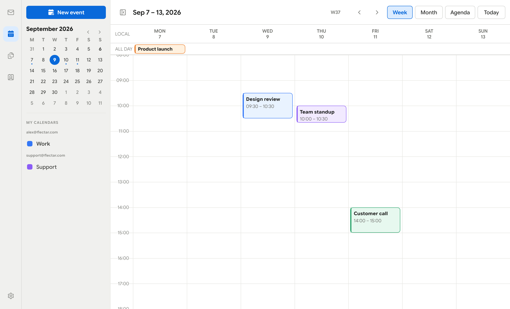
        </picture>
      </td>
      <td width="33.33%">
        <picture>
          <source media="(prefers-color-scheme: dark)" srcset="resources/screenshots/desktop-contacts-dark.png">
          <source media="(prefers-color-scheme: light)" srcset="resources/screenshots/desktop-contacts-light.png">
          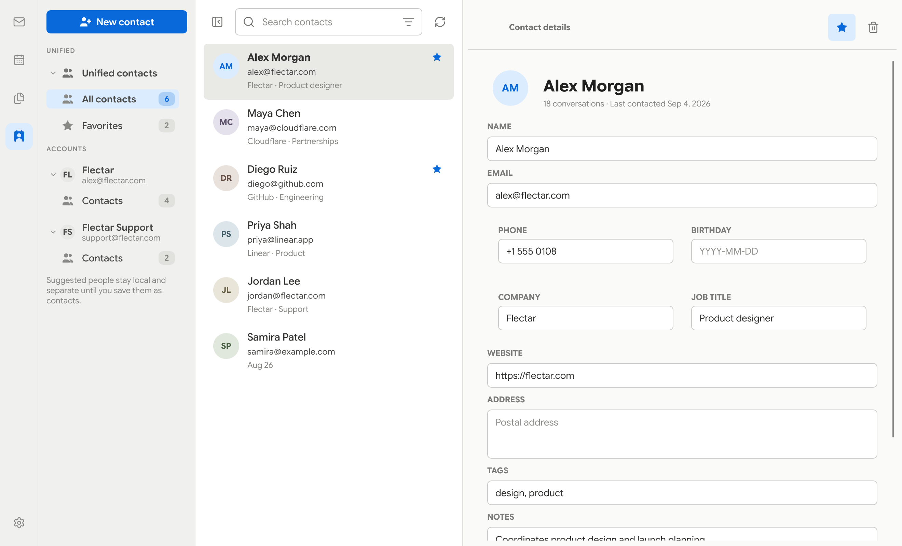
        </picture>
      </td>
      <td width="33.33%">
        <picture>
          <source media="(prefers-color-scheme: dark)" srcset="resources/screenshots/desktop-files-dark.png">
          <source media="(prefers-color-scheme: light)" srcset="resources/screenshots/desktop-files-light.png">
          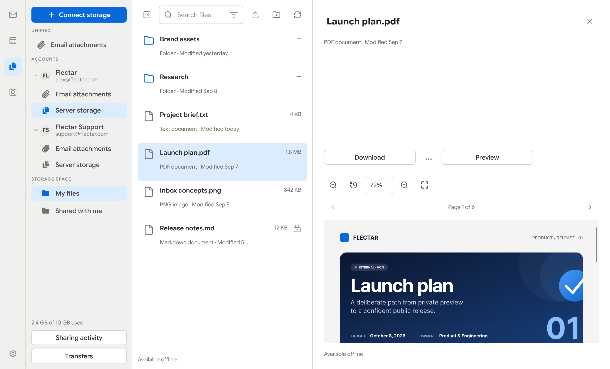
        </picture>
      </td>
    </tr>
  </tbody>
</table>

### 💾 存储与备份

「设置 → 存储」会显示邮件、附件、离线文件和数据库在本机占用的空间。在同一页面中，你可以导出经过校验的数据库快照，也可以通过备份迁移已连接账户的配置与偏好设置。密码和 OAuth 令牌保存在系统密钥环中，因此恢复后的设备会要求你重新登录。

<picture>
  <source media="(prefers-color-scheme: dark)" srcset="resources/screenshots/desktop-storage-dark.png">
  <source media="(prefers-color-scheme: light)" srcset="resources/screenshots/desktop-storage-light.png">
  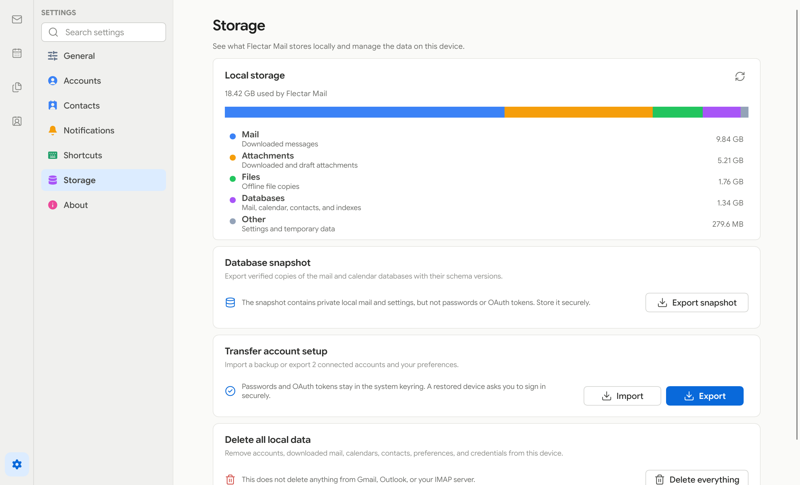
</picture>

### 📱 为小屏幕而设计

紧凑界面让重要操作触手可及，同时在需要时为邮件、日程和联系人提供完整的屏幕空间。

| 浅色                                                                             | 深色                                                                            |
|----------------------------------------------------------------------------------|---------------------------------------------------------------------------------|
| 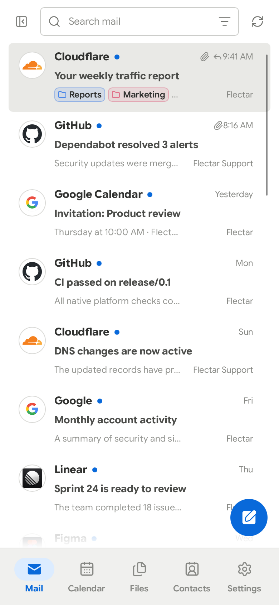 | 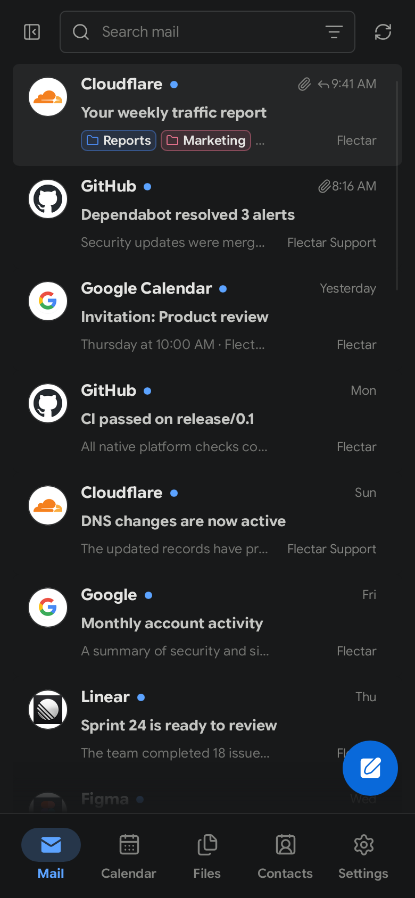 |

## 📥 获取 Flectar Mail

Flectar Mail 目前仍在开发中，尚未稳定。

> [!WARNING]
> **Google OAuth 验证需要每年进行一次 CASA 安全评估。** Flectar 是社区开源项目，因此能否完成该项评估取决于赞助支持。在所需的验证获得资金并完成之前，无法推出默认配置 Gmail OAuth 的稳定版本。如果你希望帮助实现内置的 Gmail 登录，请[赞助 Flectar](https://github.com/sponsors/flectar)。
>
> Google 与 Microsoft 的 OAuth 验证仍在进行中。此前的 GitHub 预发布版本面向自行提供 OAuth 注册信息、或使用 IMAP/JMAP 账户的测试者。

未内置 OAuth 应用密钥的构建版本会禁用 Gmail 和 Outlook 登录。可使用欢迎界面上的**登录设置**齿轮，保存你自己的 Google 或 Microsoft 应用注册信息，或连接 IMAP/JMAP 账户。自定义密钥与「设置」共用，并优先于内置密钥；清除自定义客户端 ID 后，在可用的情况下会恢复默认值。保存配置后，各服务商会分别启用。

预览构建发布后，请从 [GitHub Releases](https://github.com/flectar/mail/releases) 下载，并留意 **Pre-release** 标记：

- **Linux x64：** AppImage、Debian/Ubuntu `.deb`、Fedora `.rpm`，或手动侧载（sideload）的 Flatpak 预览包
- **Windows x64：** 安装程序 `.exe` 或便携版 ZIP
- **macOS Apple 芯片或 Intel（macOS 14+）：** DMG 或应用程序 ZIP
- **Android arm64（Android 8.0+）：** 预发布版本中的实验性测试 APK

Windows 预览版未签名；macOS 预览版采用临时签名（ad-hoc）且未经过公证，因此出现操作系统安全提示属于正常现象。更新需要手动安装。

Flatpak 预览版以独立测试包的形式提供。它目前还不是 Flathub 软件包，因此不会获得 Flathub 的自动更新。在托盘后端能够使用沙箱安全的 D-Bus 名称之前，其「关闭到托盘」选项处于禁用状态。

使用 `sudo dnf install ./flectar-mail-<version>-linux-x64.rpm` 或 `flatpak install --user ./flectar-mail-<version>-linux-x64.flatpak` 安装下载的 Linux 软件包。用 `flatpak run com.flectar.mail` 启动 Flatpak 版本。

每个 GitHub 发布版本都包含 `SHA256SUMS` 和已签名的构建来源证明。安装 GitHub CLI 后，可用 `gh attestation verify <download> --repo flectar/mail` 校验下载内容。

Android APK 更新需要使用相同的签名密钥；未使用固定测试密钥的构建版本可能需要先卸载旧版应用，而卸载会删除本地应用数据。

你也可以使用 [Rust 工具链](https://rustup.rs/) 从源码构建 Flectar Mail：

```bash
cargo run --bin flectar-mail
```

Linux 桌面端的 OAuth 通过桌面门户（desktop portal）调用系统浏览器，并借助 freedesktop Secret Service 保存刷新凭证。因此，常规桌面会话需要 `xdg-desktop-portal` 后端，以及 GNOME Keyring 之类的 Secret Service 提供程序。当无法安全存储凭证时，发布版本会在打开 OAuth 页面之前中止；没有安全的持久化位置，授权流程就不可能完成。

Podman 和 Docker 开发环境通常既没有宿主会话的 D-Bus，也无法访问宿主浏览器的回环网络。调试构建支持这种环境：它提供标记明确、仅限所有者访问的开发凭证文件，以及用于粘贴最终回环回调 URL 的折叠面板。该文件后端不会包含在发布版本中。

## 🌍 帮助翻译 Flectar Mail

Flectar Mail 为所有人而构建，我们期待你帮助它支持更多语言！

我们使用 [Weblate](https://translate.flectar.com/) 管理社区翻译。无论你是想把 Flectar Mail 翻译成自己的母语、改进现有译文，还是参与审校，我们都欢迎每一份贡献。

**[开始翻译 Flectar Mail →](https://translate.flectar.com/)**

开始上手很简单：

1. 在我们的翻译平台上创建一个账户。
2. 选择你的语言；如果该语言尚不存在，就发起一项新的翻译。
3. 直接在 Weblate 中翻译文本，无需编程或 GitHub 使用经验。

译文会与我们的 GitHub 仓库同步，并以拉取请求的形式提交审阅。贡献者还可以为自己的工作在 GitHub 上获得署名。

## 🌐 面向所有人的开源

Flectar Mail 只有一个开源版本，没有单独划分的社区版。客户端采用 [GNU Affero 通用公共许可证 v3](LICENSE) 授权。实际细节请阅读[许可说明](LICENSING.md)；如需参与项目建设，请参阅 [CONTRIBUTING.md](CONTRIBUTING.md)。

## 🫡 致谢

Flectar Mail 的实现离不开以下项目及其贡献者的工作：

- [Slint](https://slint.dev/)，驱动 Flectar Mail 界面的原生 UI 工具包。
- [Blitz](https://github.com/DioxusLabs/blitz)，Dioxus 团队开发的 Rust HTML/CSS 渲染器，支撑邮件阅读体验。

---
